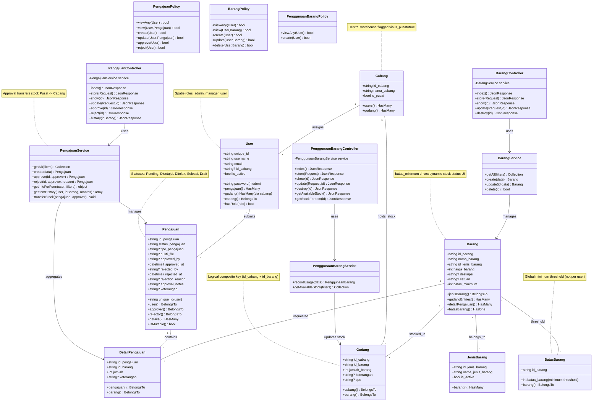
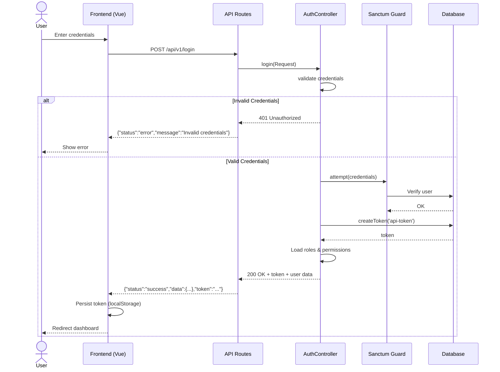
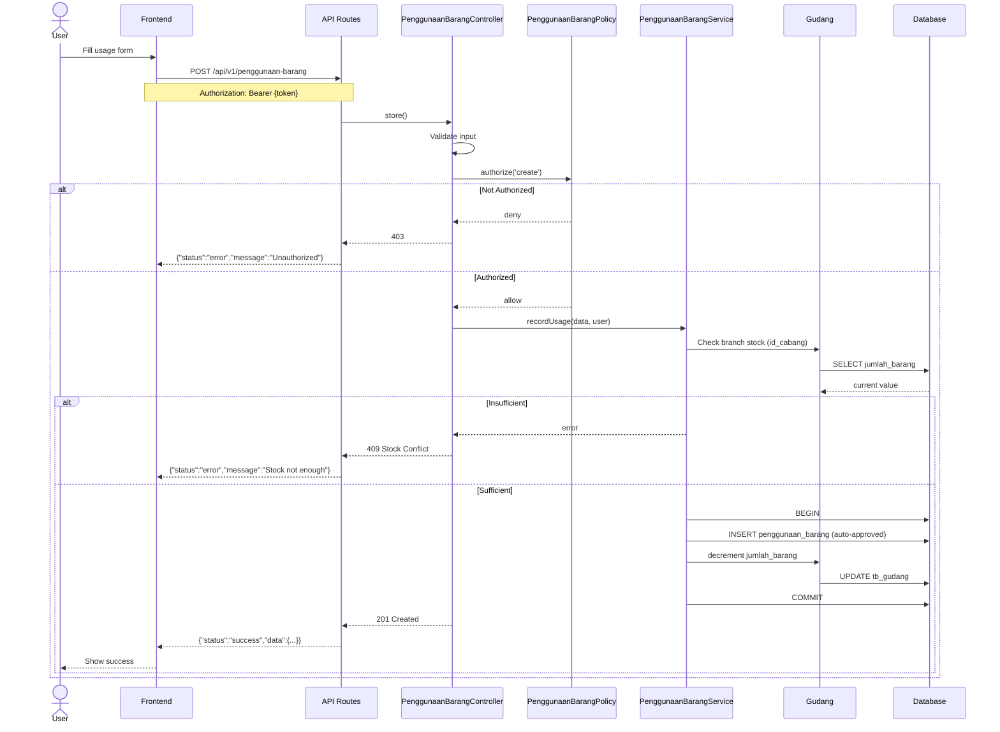
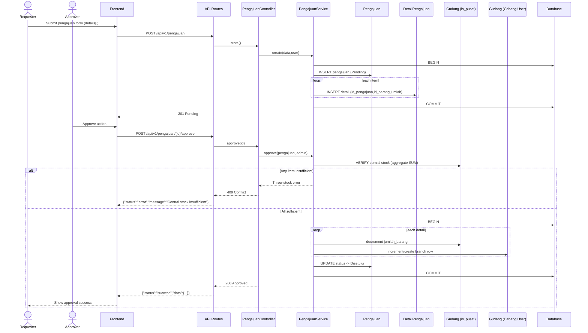
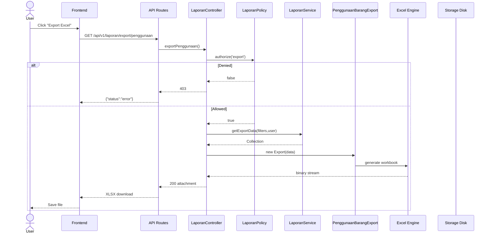
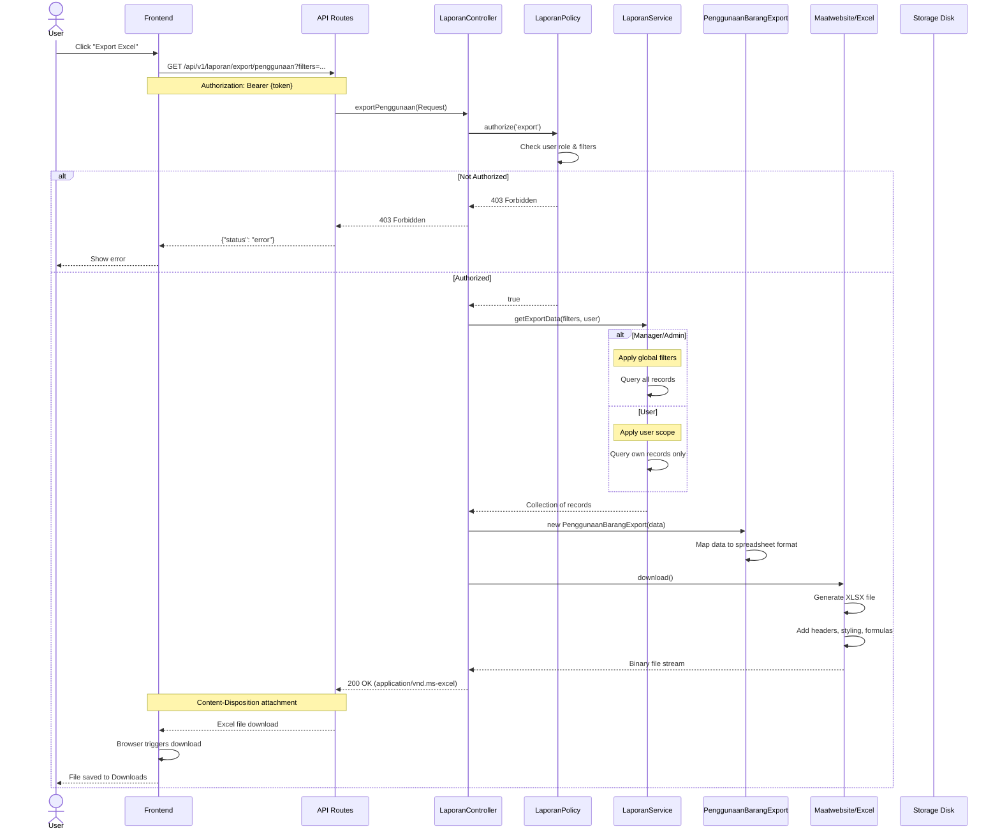
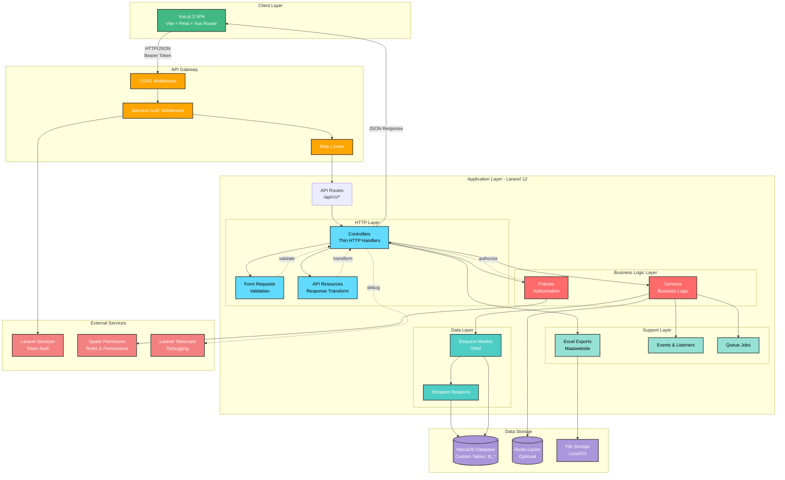
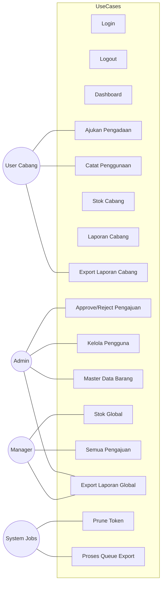

# 🎨 UML Diagrams - SIMBA Backend

**Generated:** November 22, 2025  
**Architecture:** Service-Oriented Laravel 12 API (Updated after Cabang & Gudang refactor, Pengajuan stock logic changes)

---

## 📋 Table of Contents

1. [Class Diagram](#1-class-diagram-architecture)
2. [Sequence Diagrams](#2-sequence-diagrams-workflows)
3. [Component Diagram](#3-component-diagram-layered-architecture)

---

## 1. Class Diagram (Architecture)

### Service-Controller-Model-Policy Relationships (Updated)



### Key Design Patterns (Unchanged Principles)

- **Thin Controllers:** Only handle HTTP request/response
- **Service Layer:** All business logic encapsulated here
- **Policy Authorization:** Gate checks before actions
- **Eloquent Relations:** Type-safe model relationships
- **Transaction Safety:** Stock transfer & usage mutations wrapped atomically
- **Stateless Auth:** Sanctum Bearer tokens + Spatie Roles

---

## 2. Sequence Diagrams (Workflows)

### 2.1 Login Flow (Sanctum Authentication)



### 2.2 Penggunaan Barang Creation (Auto-Approve, Branch-Based Stock)



**Key Points:**
- Auto-approved usage
- Branch-based stock (`id_cabang`) not per-user private stock
- Manager role read-only (cannot create)

### 2.3 Pengajuan Approval & Stock Transfer (New)



**Key Changes:**
- Stock movement is branch-based using `id_cabang` (not user-based records)
- Central warehouse identified by `cabang.is_pusat = true`
- No per-item per-user limit; monthly usage tracked separately (form info API)

### 2.4 Export Excel Flow (Reconfirmed)



**Export Rules (Reconfirmed):**
- ✅ Admin: Export all data (all cabang)
- ✅ Manager: Export all data (oversight)
- ✅ User: Export own cabang-scoped / personal usage records

---

## 3. Component Diagram (Layered Architecture)

### System-Level Architecture (Updated Stock & Cabang Context)

```mermaid
graph TB
    subgraph "Client Layer"
        FE[Vue.js 3 SPA<br/>Vite + Pinia + Router]
    end

    subgraph "API Gateway"
        CORS[CORS Middleware]
        Auth[Sanctum Auth]
        Rate[Rate Limiter]
    end

    subgraph "Application Layer"
        Routes[API Routes /api/v1/*]
        Controllers[Controllers]
        FormReq[Form Requests]
        Resources[API Resources]
        Services[Service Layer]
        Policies[Policies]
        Models[Eloquent Models]
        Exports[Excel Exports]
        Events[Events]
        Jobs[Queue Jobs]
    end

    subgraph "External Services"
        Sanctum[Sanctum Tokens]
        Spatie[Spatie Permission]
        Telescope[Telescope Debug]
    end

    subgraph "Data Storage"
        DB[(MariaDB<br/>tb_users, tb_cabang, tb_pengajuan, tb_detail_pengajuan, tb_barang, tb_gudang, tb_batas_barang)]
        Cache[(Redis/File Cache)]
        Storage[File Storage]
    end

    FE -->|Bearer JSON| CORS --> Auth --> Rate --> Routes
    Routes --> Controllers --> Services --> Models --> DB
    Controllers --> FormReq
    Controllers --> Policies
    Controllers --> Resources
    Controllers --> Exports
    Services --> Events
    Services --> Jobs
    Services --> Cache
    Models --> Storage
    Auth --> Sanctum
    Policies --> Spatie
    Controllers -.debug.-> Telescope

    Resources --> FE

    classDef gateway fill:#ffa500,stroke:#333,color:#fff
    classDef service fill:#ff6b6b,stroke:#333,color:#fff
    classDef model fill:#4ecdc4,stroke:#333,color:#fff
    classDef data fill:#aa96da,stroke:#333,color:#fff
    classDef external fill:#f38181,stroke:#333,color:#fff
    classDef client fill:#42b983,stroke:#333,color:#fff

    class CORS,Auth,Rate gateway
    class Services service
    class Models model
    class DB,Cache,Storage data
    class Sanctum,Spatie,Telescope external
    class FE client

    %% Updated Notes
    note right of Services "PengajuanService: central (is_pusat) stock aggregation + transfer"
    note right of Models "Gudang now branch-based, not per-user private stock"
    note right of DB "Cabang.is_pusat differentiates central vs branch warehouses"
    note right of Resources "Adds stock_info to barang items"
```

### Request Flow (Updated Pengajuan Approval)

1. User submits draft pengajuan → Pending with detail rows
2. Approver triggers approval → validates central (is_pusat) stock
3. Transaction: decrement pusat Gudang; increment/create cabang Gudang rows
4. Status updated → Disetujui; monthly usage reflected in form info
5. Resource returns enriched pengajuan with detail & derived stock movements
6. Frontend updates UI accordingly

---

## 📊 Diagram Legend

| Symbol | Meaning |
|--------|---------|
| `-->` | Dependency / Uses |
| `--` | Association |
| `..>` | Authorizes / Policy relation |
| `*` | Many (Cardinality) |
| `1` | One (Cardinality) |

---

## 🎯 Key Architectural Principles (Reaffirmed)

1. Separation of Concerns (Controllers vs Services vs Policies)
2. Explicit Central Warehouse (`is_pusat`) replacing name-based heuristics
3. Branch-Level Inventory (Gudang keyed by `id_cabang`,`id_barang`)
4. Immutable Approved Pengajuan (mutable only if Pending/Draft)
5. Stock Safety via Transactional Transfer
6. Stateless Auth + RBAC enforced server-side

---

## 🛠️ Tools Used

- Mermaid for diagrams
- Laravel Sanctum + Spatie Permission for auth/RBAC
- Maatwebsite Excel for exports

---

        
        alt Not Authorized (Manager)
            Policy-->>Ctrl: 403 Forbidden
            Ctrl-->>API: 403 Forbidden
            API-->>FE: {"status": "error", "message": "Unauthorized"}
            FE-->>User: Show error
        else Authorized (Admin/User)
            Policy-->>Ctrl: true
            
            Ctrl->>Service: recordUsage(data)
            Service->>Stock: Check available stock
            Stock->>DB: SELECT stok_tersedia
            DB-->>Stock: Current stock
            
            alt Insufficient Stock
                Stock-->>Service: Stock not enough
                Service-->>Ctrl: Exception
                Ctrl-->>API: 400 Bad Request
                API-->>FE: {"status": "error", "message": "Stock not enough"}
                FE-->>User: Show error
            else Sufficient Stock
                Service->>DB: BEGIN TRANSACTION
                
                Service->>Model: create(data)
                Note over Model: status = 'approved' (auto)
                Model->>DB: INSERT penggunaan_barang
                DB-->>Model: Record created
                
                Service->>Stock: decrement stock
                Stock->>DB: UPDATE stok_gudang SET stok_tersedia = stok_tersedia - jumlah
                DB-->>Stock: Stock updated
                
                Service->>DB: COMMIT TRANSACTION
                Service-->>Ctrl: PenggunaanBarang object
                
                Ctrl->>Ctrl: Transform to Resource
                Ctrl-->>API: 201 Created
                API-->>FE: {"status": "success", "data": {...}}
                FE->>FE: Update table
                FE-->>User: Show success message
            end
        end
    end
```

**Key Points:**
- ✅ Auto-approved on creation (no approval workflow)
- ✅ Stock decremented immediately in transaction
- ✅ Manager cannot create (read-only access)
- ✅ User can only create for own records

---

### 2.3 Export Excel Flow



**Export Rules:**
- ✅ Admin: Export all data (all branches)
- ✅ Manager: Export all data (monitoring/oversight)
- ✅ User: Export own data only (scoped by unique_id)

---

## 3. Component Diagram (Layered Architecture)

### System-Level Architecture



### Request Flow

```
1. User Action (Frontend Vue.js)
   ↓
2. HTTP Request + Bearer Token
   ↓
3. CORS Check → Auth Middleware → Rate Limiter
   ↓
4. API Routes (/api/v1/*)
   ↓
5. Controller (Thin Handler)
   ├─→ Form Request (Validate Input)
   ├─→ Policy (Authorize Action)
   └─→ Service (Business Logic)
       ↓
6. Service Layer
   ├─→ Eloquent Model (Data Access)
   ├─→ Database Transaction (if needed)
   └─→ External Services (if needed)
       ↓
7. Database (MariaDB)
   ↓
8. Response Flow
   ├─→ Service returns Model/Collection
   ├─→ Controller transforms via Resource
   └─→ JSON Response
       ↓
9. Frontend Updates UI
```

---

## 📊 Diagram Legend

### Relationship Types

| Symbol | Meaning |
|--------|---------|
| `-->` | Dependency / Uses |
| `--` | Association |
| `..>` | Implements / Authorizes |
| `*` | Many (Cardinality) |
| `1` | One (Cardinality) |

### Multiplicity

- `1` : Exactly one
- `*` : Zero or many
- `0..1` : Zero or one
- `1..*` : One or many

---

## 🎯 Key Architectural Principles

### 1. **Separation of Concerns**
- Controllers: HTTP only
- Services: Business logic
- Models: Data representation
- Policies: Authorization

### 2. **Single Responsibility**
Each class has one reason to change:
- `BarangService`: Manages barang business logic
- `BarangPolicy`: Enforces barang authorization
- `BarangController`: Handles barang HTTP requests

### 3. **Dependency Injection**
```php
public function __construct(
    protected BarangService $barangService
) {}
```

### 4. **Transaction Safety**
```php
DB::transaction(function () {
    // Critical operations
});
```

### 5. **Authorization First**
```php
$this->authorize('create', Barang::class);
```

---

## 🔄 Data Flow Patterns

### Create Operation
```
User Input → Validation → Authorization → Service Logic → 
Database Transaction → Response Transform → JSON Output
```

### Query Operation
```
Request Filters → Authorization → Service with Scopes → 
Database Query → Resource Collection → JSON Output
```

### Update Operation
```
Request Data → Validation → Authorization → Service Logic → 
Find Model → Update Fields → Save → Resource → JSON Output
```

---

## 📚 References

- **Business Rules:** [BUSINESS_RULES.md](../BUSINESS_RULES.md)
- **API Documentation:** [dokumentasi-api.md](../dokumentasi-api.md)
- **Architecture Guide:** [docs/INDEX.md](INDEX.md)
- **Test Coverage:** [TEST_REPORT.md](../TEST_REPORT.md)

---

## 🛠️ Tools Used

- **Mermaid:** Markdown-native diagrams
- **VS Code:** Preview with "Markdown Preview Mermaid Support" extension
- **GitHub:** Native Mermaid rendering in README/docs

---

## 4. Use Case Diagram (PlantUML)

Diagram ini menggambarkan interaksi aktor (Admin, Manager, User Cabang, System Jobs) dengan fungsionalitas utama SIMBA. Gunakan file `docs/USE_CASE_SIMBA.puml` untuk render formal UML. Jika PlantUML tidak tersedia, gunakan fallback Mermaid sederhana di bawah.

### PlantUML Source
```plantuml
@startuml
actor Admin
actor Manager
actor User as CabangUser
actor System as Jobs
rectangle SIMBA {
  (Login) (Logout) (Lihat Dashboard)
  (Ajukan Pengadaan Barang) (Catat Penggunaan Barang)
  (Lihat Stok Cabang) (Lihat Laporan Cabang) (Export Laporan Cabang)
  (Approve / Reject Pengajuan) (Kelola Pengguna) (Kelola Master Data Barang)
  (Lihat Stok Global) (Lihat Semua Pengajuan) (Export Laporan Global)
  (Prune Token Expired) (Proses Queue Export)
}
Admin --> (Approve / Reject Pengajuan)
Admin --> (Kelola Pengguna)
Admin --> (Kelola Master Data Barang)
Admin --> (Export Laporan Global)
Manager --> (Lihat Stok Global)
Manager --> (Lihat Semua Pengajuan)
Manager --> (Export Laporan Global)
CabangUser --> (Ajukan Pengadaan Barang)
CabangUser --> (Catat Penggunaan Barang)
CabangUser --> (Export Laporan Cabang)
Jobs --> (Prune Token Expired)
Jobs --> (Proses Queue Export)
@enduml
```

### Mermaid Fallback (Approximation)


### Penjelasan Aktor & Hak Akses Singkat
- **Admin:** Full akses (persetujuan, master data, global laporan & stok).
- **Manager:** Read-only global (monitor stok & pengajuan, export global).
- **User Cabang:** Operasional cabang (pengajuan, penggunaan, laporan cabang).
- **System Jobs:** Proses otomatis (prune token kadaluarsa, proses antrian export). 

**Generated by:** GitHub Copilot  
**Last Updated:** November 22, 2025  
**Version:** 1.2 (Tambah Use Case Diagram)
