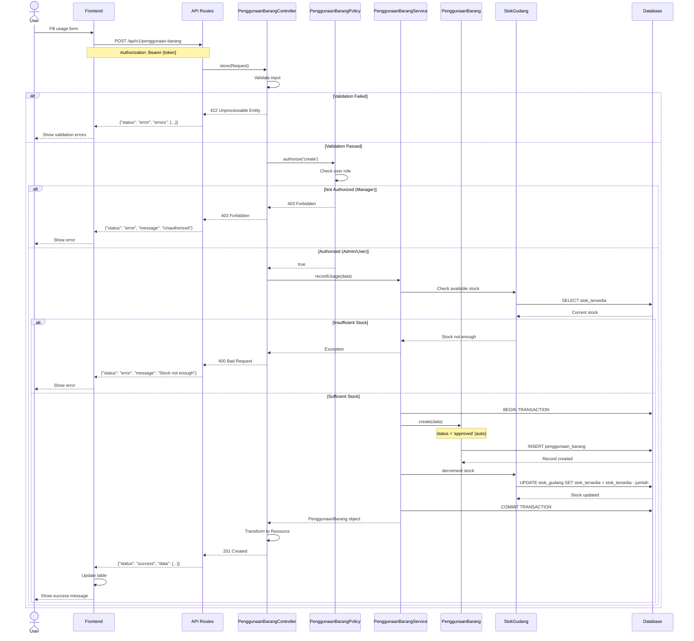
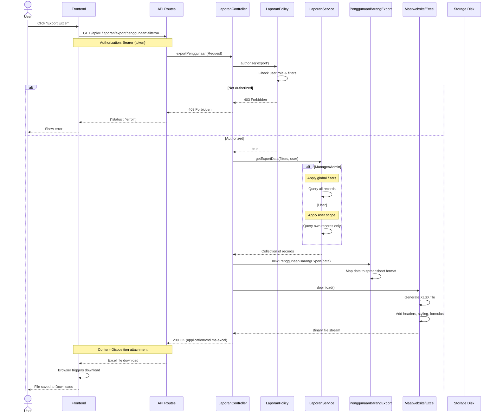
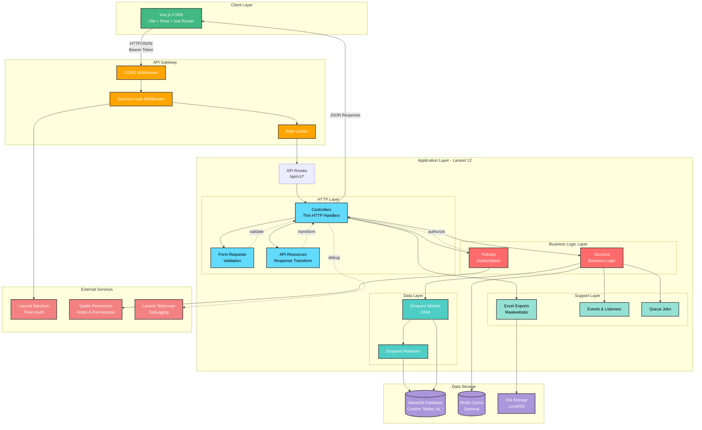

# 🎨 UML Diagrams - SIPB Backend

**Generated:** November 3, 2025  
**Architecture:** Service-Oriented Laravel 12 API

---

## 📋 Table of Contents

1. [Class Diagram](#1-class-diagram-architecture)
2. [Sequence Diagrams](#2-sequence-diagrams-workflows)
3. [Component Diagram](#3-component-diagram-layered-architecture)

---

## 1. Class Diagram (Architecture)

### Service-Controller-Model-Policy Relationships

```mermaid
classDiagram
    %% Controllers Layer
    class PenggunaanBarangController {
        -PenggunaanBarangService service
        +index() JsonResponse
        +store(Request) JsonResponse
        +show(id) JsonResponse
        +update(Request, id) JsonResponse
        +destroy(id) JsonResponse
        +getAvailableStock() JsonResponse
        +getStockForItem(id) JsonResponse
    }

    class BarangController {
        -BarangService service
        +index() JsonResponse
        +store(Request) JsonResponse
        +show(id) JsonResponse
        +update(Request, id) JsonResponse
        +destroy(id) JsonResponse
    }

    class PengajuanController {
        -PengajuanService service
        +index() JsonResponse
        +store(Request) JsonResponse
        +show(id) JsonResponse
        +update(Request, id) JsonResponse
        +approve(id) JsonResponse
        +reject(id) JsonResponse
    }

    %% Services Layer
    class PenggunaanBarangService {
        +getAll(filters) Collection
        +getById(id) PenggunaanBarang
        +recordUsage(data) PenggunaanBarang
        +update(id, data) PenggunaanBarang
        +delete(id) bool
        +getAvailableStock(filters) Collection
        +getStockForItem(idBarang) StokGudang
    }

    class BarangService {
        +getAll(filters) Collection
        +getById(id) Barang
        +create(data) Barang
        +update(id, data) Barang
        +delete(id) bool
    }

    class PengajuanService {
        +getAll(filters) Collection
        +create(data) Pengajuan
        +approve(id, adminId) Pengajuan
        +reject(id, adminId, reason) Pengajuan
    }

    %% Models Layer
    class User {
        +ULID unique_id
        +string name
        +string email
        +string password
        +hasRole(role) bool
        +hasAnyRole(roles) bool
        +penggunaanBarang() HasMany
        +pengajuan() HasMany
        +stokGudang() HasMany
    }

    class PenggunaanBarang {
        +ULID id_penggunaan_barang
        +ULID id_barang
        +ULID id_user
        +int jumlah
        +enum status
        +date tanggal_penggunaan
        +user() BelongsTo
        +barang() BelongsTo
    }

    class Barang {
        +ULID id_barang
        +string nama_barang
        +string kode_barang
        +ULID id_jenis_barang
        +int stok_minimum
        +jenisBarang() BelongsTo
        +stokGudang() HasMany
        +penggunaanBarang() HasMany
    }

    class StokGudang {
        +ULID id_stok_gudang
        +ULID id_barang
        +ULID id_user
        +int stok_tersedia
        +date tanggal_update
        +barang() BelongsTo
        +user() BelongsTo
    }

    class Pengajuan {
        +ULID id_pengajuan
        +ULID id_barang
        +ULID id_user_pengaju
        +ULID id_admin_approval
        +int jumlah
        +enum status
        +string alasan_penolakan
        +userPengaju() BelongsTo
        +adminApproval() BelongsTo
        +barang() BelongsTo
    }

    class JenisBarang {
        +ULID id_jenis_barang
        +string nama_jenis
        +string kode_jenis
        +barang() HasMany
    }

    %% Policies Layer
    class PenggunaanBarangPolicy {
        +viewAny(User) bool
        +view(User, PenggunaanBarang) bool
        +create(User) bool
        +update(User, PenggunaanBarang) bool
        +delete(User, PenggunaanBarang) bool
    }

    class BarangPolicy {
        +viewAny(User) bool
        +view(User, Barang) bool
        +create(User) bool
        +update(User, Barang) bool
        +delete(User, Barang) bool
    }

    class PengajuanPolicy {
        +viewAny(User) bool
        +view(User, Pengajuan) bool
        +create(User) bool
        +update(User, Pengajuan) bool
        +approve(User) bool
        +reject(User) bool
    }

    %% Relationships - Controller to Service
    PenggunaanBarangController --> PenggunaanBarangService : uses
    BarangController --> BarangService : uses
    PengajuanController --> PengajuanService : uses

    %% Relationships - Service to Model
    PenggunaanBarangService --> PenggunaanBarang : manages
    PenggunaanBarangService --> StokGudang : updates stock
    BarangService --> Barang : manages
    PengajuanService --> Pengajuan : manages

    %% Relationships - Model to Model
    User "1" -- "*" PenggunaanBarang : creates
    User "1" -- "*" Pengajuan : submits
    User "1" -- "*" StokGudang : owns
    Barang "1" -- "*" PenggunaanBarang : used in
    Barang "1" -- "*" StokGudang : tracked in
    Barang "1" -- "*" Pengajuan : requested
    Barang "*" -- "1" JenisBarang : belongs to

    %% Relationships - Controller to Policy
    PenggunaanBarangController ..> PenggunaanBarangPolicy : authorizes
    BarangController ..> BarangPolicy : authorizes
    PengajuanController ..> PengajuanPolicy : authorizes

    %% Notes
    note for PenggunaanBarangService "Auto-approve on create\nDecrements stock immediately"
    note for User "Roles: admin, manager, user\nManager is read-only"
    note for PenggunaanBarang "Status: auto-approved\nNo approval workflow"
```



### Key Design Patterns

- **Thin Controllers:** Only handle HTTP request/response
- **Service Layer:** All business logic encapsulated here
- **Policy Authorization:** Gate checks before actions
- **Eloquent Relations:** Type-safe model relationships

---

## 2. Sequence Diagrams (Workflows)

### 2.1 Login Flow (Sanctum Authentication)


---

### 2.2 Penggunaan Barang Creation (Auto-Approve)



**Key Points:**
- ✅ Auto-approved on creation (no approval workflow)
- ✅ Stock decremented immediately in transaction
- ✅ Manager cannot create (read-only access)
- ✅ User can only create for own records

---

### 2.3 Export Excel Flow



**Export Rules:**
- ✅ Admin: Export all data (all branches)
- ✅ Manager: Export all data (monitoring/oversight)
- ✅ User: Export own data only (scoped by unique_id)

---

## 3. Component Diagram (Layered Architecture)

### System-Level Architecture



### Request Flow

```
1. User Action (Frontend Vue.js)
   ↓
2. HTTP Request + Bearer Token
   ↓
3. CORS Check → Auth Middleware → Rate Limiter
   ↓
4. API Routes (/api/v1/*)
   ↓
5. Controller (Thin Handler)
   ├─→ Form Request (Validate Input)
   ├─→ Policy (Authorize Action)
   └─→ Service (Business Logic)
       ↓
6. Service Layer
   ├─→ Eloquent Model (Data Access)
   ├─→ Database Transaction (if needed)
   └─→ External Services (if needed)
       ↓
7. Database (MariaDB)
   ↓
8. Response Flow
   ├─→ Service returns Model/Collection
   ├─→ Controller transforms via Resource
   └─→ JSON Response
       ↓
9. Frontend Updates UI
```

---

## 📊 Diagram Legend

### Relationship Types

| Symbol | Meaning |
|--------|---------|
| `-->` | Dependency / Uses |
| `--` | Association |
| `..>` | Implements / Authorizes |
| `*` | Many (Cardinality) |
| `1` | One (Cardinality) |

### Multiplicity

- `1` : Exactly one
- `*` : Zero or many
- `0..1` : Zero or one
- `1..*` : One or many

---

## 🎯 Key Architectural Principles

### 1. **Separation of Concerns**
- Controllers: HTTP only
- Services: Business logic
- Models: Data representation
- Policies: Authorization

### 2. **Single Responsibility**
Each class has one reason to change:
- `BarangService`: Manages barang business logic
- `BarangPolicy`: Enforces barang authorization
- `BarangController`: Handles barang HTTP requests

### 3. **Dependency Injection**
```php
public function __construct(
    protected BarangService $barangService
) {}
```

### 4. **Transaction Safety**
```php
DB::transaction(function () {
    // Critical operations
});
```

### 5. **Authorization First**
```php
$this->authorize('create', Barang::class);
```

---

## 🔄 Data Flow Patterns

### Create Operation
```
User Input → Validation → Authorization → Service Logic → 
Database Transaction → Response Transform → JSON Output
```

### Query Operation
```
Request Filters → Authorization → Service with Scopes → 
Database Query → Resource Collection → JSON Output
```

### Update Operation
```
Request Data → Validation → Authorization → Service Logic → 
Find Model → Update Fields → Save → Resource → JSON Output
```

---

## 📚 References

- **Business Rules:** [BUSINESS_RULES.md](../BUSINESS_RULES.md)
- **API Documentation:** [dokumentasi-api.md](../dokumentasi-api.md)
- **Architecture Guide:** [docs/INDEX.md](INDEX.md)
- **Test Coverage:** [TEST_REPORT.md](../TEST_REPORT.md)

---

## 🛠️ Tools Used

- **Mermaid:** Markdown-native diagrams
- **VS Code:** Preview with "Markdown Preview Mermaid Support" extension
- **GitHub:** Native Mermaid rendering in README/docs

---

**Generated by:** GitHub Copilot  
**Last Updated:** November 3, 2025  
**Version:** 1.0
